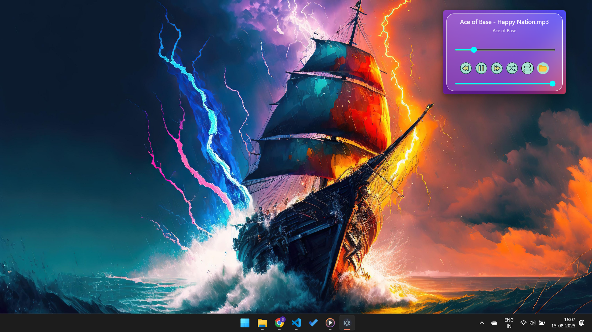

# 🎵 Mini Window Music Player

A **simple, lightweight, and pleasant-to-use** desktop music player built with **Electron.js**.  
It fetches music files from your **local directory**, remembers your library for future sessions, and provides all the **essential controls** you’d expect from a basic music player — all in a compact, minimal window.

---

## ✨ Features

- 📂 **Local Music Library** — Load your favorite songs directly from your computer.
- 💾 **Persistent Storage** — Remembers your music library across app restarts.
- 🎚 **Basic Music Controls** — Play, pause, next, previous, seek, and volume control.
- 🖥 **Mini Window UI** — Compact, clean, and pleasant design that stays out of your way.
- ⚡ **Lightweight & Fast** — Smooth performance without heavy resource usage.

---

## 📸 Screenshot


---

## 🛠 Installation & Setup

Make sure you have **Node.js** and **npm** installed.

1. **Clone this repository**
   ```bash
   git clone https://github.com/yourusername/mini-window-music-player.git
   cd mini-window-music-player
    ```
2. **Install dependencies**
```bash
npm install
```

3. **Start the app in development mode**
```bash 
npm start
```

4. **Build the app for production**
```bash
npm run build
```

This will generate your application package inside the dist folder.

## ⚙️ How It Works
- On first launch, you select a local directory containing your music files.
- The app scans for supported audio formats (.mp3, .wav, .flac, etc.).
- Your library is stored locally, so you don’t need to reselect the folder every time.
- Use the built-in controls to play, pause, skip, or adjust the volume.

## Requirements

- Node.js: v16 or later
- npm: v8 or later
- OS: Windows, macOS, or Linux

## 📄 License
This project is licensed under the MIT License — you are free to use, modify, and distribute it.


## 💡 Contributing

### If you’d like to improve this project:
- Fork the repo
- Create a new branch: git checkout -b feature-name
- Commit your changes: git commit -m 'Add new feature'
- Push the branch: git push origin feature-name
- Open a Pull Request

## 🙌 Acknowledgments

Electron.js — for enabling cross-platform desktop apps using web tech.

All open-source contributors who inspire and make projects like this possible.

